# Pebble

**Version:** 0.0.6 | **Identifier:** com.qingj01.pebble

## 项目愿景

Pebble 是一款跨平台桌面邮件客户端，基于 Tauri v2 构建。它支持 IMAP/Gmail/Outlook 邮件同步、全文搜索、邮件加密、规则自动化、看板视图、云备份等核心功能，以 Rust 后端保障性能与安全，以 React 前端提供现代化交互体验。

## 架构总览

Pebble 采用 Tauri 2 架构：Rust 后端提供所有业务逻辑、数据持久化和系统集成，React/TypeScript 前端通过 Tauri IPC 调用后端命令。

```mermaid
graph TD
    A["(根) Pebble 桌面邮件客户端"] --> B["src-tauri"];
    A --> C["crates"];
    A --> D["src (前端)"];

    B --> B1["commands (Tauri 命令层)"];
    B --> B2["state (应用状态)"];
    B --> B3["realtime (实时同步)"];
    B --> B4["snooze_watcher (延迟发送)"];
    B --> B5["events (事件系统)"];

    C --> C1["pebble-core"];
    C --> C2["pebble-store"];
    C --> C3["pebble-mail"];
    C --> C4["pebble-search"];
    C --> C5["pebble-rules"];
    C --> C6["pebble-translate"];
    C --> C7["pebble-crypto"];
    C --> C8["pebble-oauth"];
    C --> C9["pebble-privacy"];

    D --> D1["features (视图组件)"];
    D --> D2["components (通用组件)"];
    D --> D3["stores (Zustand 状态)"];
    D --> D4["hooks (React Hooks)"];
    D --> D5["lib (工具库)"];

    B1 --> C1;
    B1 --> C2;
    B1 --> C3;
    B1 --> C4;
    B1 --> C5;
    B1 --> C6;
    B1 --> C7;
    B1 --> C8;
    B1 --> C9;

    click B "./src-tauri/CLAUDE.md" "查看 Tauri 后端核心"
    click C1 "./crates/pebble-core/CLAUDE.md" "查看 pebble-core 共享类型"
    click C2 "./crates/pebble-store/CLAUDE.md" "查看 pebble-store 数据层"
    click C3 "./crates/pebble-mail/CLAUDE.md" "查看 pebble-mail 邮件引擎"
    click C4 "./crates/pebble-search/CLAUDE.md" "查看 pebble-search 全文搜索"
    click C5 "./crates/pebble-rules/CLAUDE.md" "查看 pebble-rules 规则引擎"
    click C6 "./crates/pebble-translate/CLAUDE.md" "查看 pebble-translate 翻译服务"
    click C7 "./crates/pebble-crypto/CLAUDE.md" "查看 pebble-crypto 加密服务"
    click C8 "./crates/pebble-oauth/CLAUDE.md" "查看 pebble-oauth OAuth 集成"
    click C9 "./crates/pebble-privacy/CLAUDE.md" "查看 pebble-privacy 隐私保护"
    click D "./src/CLAUDE.md" "查看 React 前端"
```

## 模块索引

| 模块 | 路径 | 语言 | 职责简述 |
|------|------|------|----------|
| Tauri 核心 | `src-tauri` | Rust | 应用入口、命令路由、系统托盘、后台工作线程 |
| pebble-core | `crates/pebble-core` | Rust | 共享类型 (Account/Message/Folder/Rule)、错误定义、trait |
| pebble-store | `crates/pebble-store` | Rust | SQLite 数据层 (r2d2 连接池)、迁移、全部实体 CRUD |
| pebble-mail | `crates/pebble-mail` | Rust | IMAP/SMTP 邮件引擎：同步、IDLE、Gmail/Outlook 专用、线程化 |
| pebble-search | `crates/pebble-search` | Rust | Tantivy 全文搜索、索引管理、高级搜索 |
| pebble-rules | `crates/pebble-rules` | Rust | 规则引擎：条件匹配与动作执行 |
| pebble-translate | `crates/pebble-translate` | Rust | 翻译服务：DeepL/DeepLX/Generic API/LLM |
| pebble-crypto | `crates/pebble-crypto` | Rust | AES-GCM 加密 + OS 密钥链 DEK 管理 |
| pebble-oauth | `crates/pebble-oauth` | Rust | OAuth2 流程（Google/Microsoft） |
| pebble-privacy | `crates/pebble-privacy` | Rust | HTML 消毒 + 邮件追踪器拦截 |
| 前端 | `src` | TypeScript/React | React SPA：收件箱、撰写、看板、设置、搜索等视图 |

## 运行与开发

### 前置条件
- Node.js (>= 18) + pnpm
- Rust (>= 1.75, edition 2021)
- Tauri CLI (`@tauri-apps/cli`)

### 开发命令

| 命令 | 说明 |
|------|------|
| `pnpm dev` | 启动 Tauri 开发模式 (含热重载) |
| `pnpm dev:frontend` | 仅启动前端 Vite 开发服务器 |
| `pnpm build` | 构建完整 Tauri 应用 |
| `pnpm build:frontend` | 仅构建前端 |
| `pnpm test` | 运行 Vitest 测试 |
| `pnpm test:watch` | 运行 Vitest 监听模式 |

### 平台特定构建

| 命令 | 目标 |
|------|------|
| `pnpm build:windows` | Windows NSIS 安装包 |
| `pnpm build:macos` | macOS .app + .dmg |
| `pnpm build:linux` | Linux AppImage |

### 环境变量

OAuth 凭据通过 `.env` 文件注入 (构建时读取):
- `GOOGLE_CLIENT_ID` / `GOOGLE_CLIENT_SECRET`
- `MICROSOFT_CLIENT_ID` / `MICROSOFT_CLIENT_SECRET`

## 测试策略

### Rust 层
- 使用 `cargo test` 运行 crate 内 `#[cfg(test)]` 模块
- 有测试的 crate: `src-tauri`, `pebble-store`, `pebble-search`, `pebble-rules`, `pebble-crypto`
- `pebble-crypto` 测试标记为 `#[ignore]` (需要 OS 密钥链访问)
- `pebble-store` 使用 `open_in_memory()` 进行单元测试

### 前端层
- 使用 Vitest + `@testing-library/react`
- jsdom 环境
- 命令: `pnpm test`

## 编码规范

### Rust
- Edition 2021
- 统一错误类型: `pebble_core::Result<T>` + `thiserror`
- 日志: `tracing` + `tracing-subscriber` (env-filter)
- 异步: `tokio` runtime
- 工作区管理: 顶层 `Cargo.toml` 定义公共依赖版本

### TypeScript/React
- TypeScript strict mode (`noUnusedLocals`, `noUnusedParameters`)
- React 19 + JSX
- 路径别名: `@/*` -> `src/*`
- 状态管理: Zustand
- 数据获取: TanStack React Query
- 国际化: i18next + react-i18next
- 样式: TailwindCSS v4

### 代码质量工具
- TypeScript 编译即类型检查 (`noEmit: true`)
- Tauri build 包含 TypeScript 检查 (`tsc && vite build`)

## AI 使用指引

### 关键架构概念
1. **命令层 (`src-tauri/src/commands/`)**: 所有 Tauri invoke 调用在此注册。每个子模块对应一组相关命令。
2. **AppState**: 在 `state.rs` 定义，持有 store/search/crypto/sync_handles 的 Arc 引用，通过 `app.manage()` 注册。
3. **数据流**: 前端 `@/lib/api.ts` -> Tauri invoke -> commands -> pebble_store / pebble_mail 等 crate
4. **后台工作线程**:
   - `snooze_watcher`: 监控延迟邮件到期
   - `sync_cmd::resume_all_syncs`: 自动恢复所有账号同步
   - `pending_mail_ops`: 处理待发送邮件队列
   - 搜索索引重建 (spawn_blocking)

### 数据模型
- **Account**: 邮件账号 (IMAP/Gmail/Outlook)
- **Message**: 邮件实体 (含 soft-delete)
- **Folder**: 文件夹/邮箱 (含系统文件夹角色)
- **Rule**: 自动化规则 (JSON 条件 + 动作)
- 所有 ID 使用 UUID v4

### 存储
- SQLite: `pebble-store` crate, r2d2 连接池 (1写 + 4读)
- Tantivy: `pebble-search` crate, 独立索引目录
- 附件: 文件系统存储 (`attachments_dir`)
- 敏感数据: OS 密钥链 (keyring crate) + AES-GCM 加密

## 变更记录 (Changelog)

### 2026-05-06 22:21:00
- 补全所有文档的文件清单 (60 个 Rust 源文件 + 111 个前端源文件)
- 补全 src-tauri/CLAUDE.md: 30 个命令模块完整输入输出类型参考
- 补全 src/CLAUDE.md: 完整文件清单、lib/ 目录详解 (15 文件)、api.ts 24 个 API 模块分类
- 补全所有 9 个 crate 的子模块文件清单

### 2026-05-06 22:10:36
- 初始架构文档生成
- 识别 10 个 Rust 模块 + 1 个前端模块
- 覆盖所有 crate 的 lib.rs 入口、src-tauri 命令层、前端 Layout 结构
- 生成 Mermaid 架构图与模块索引
